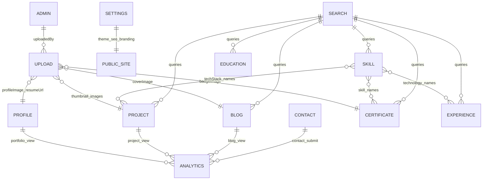
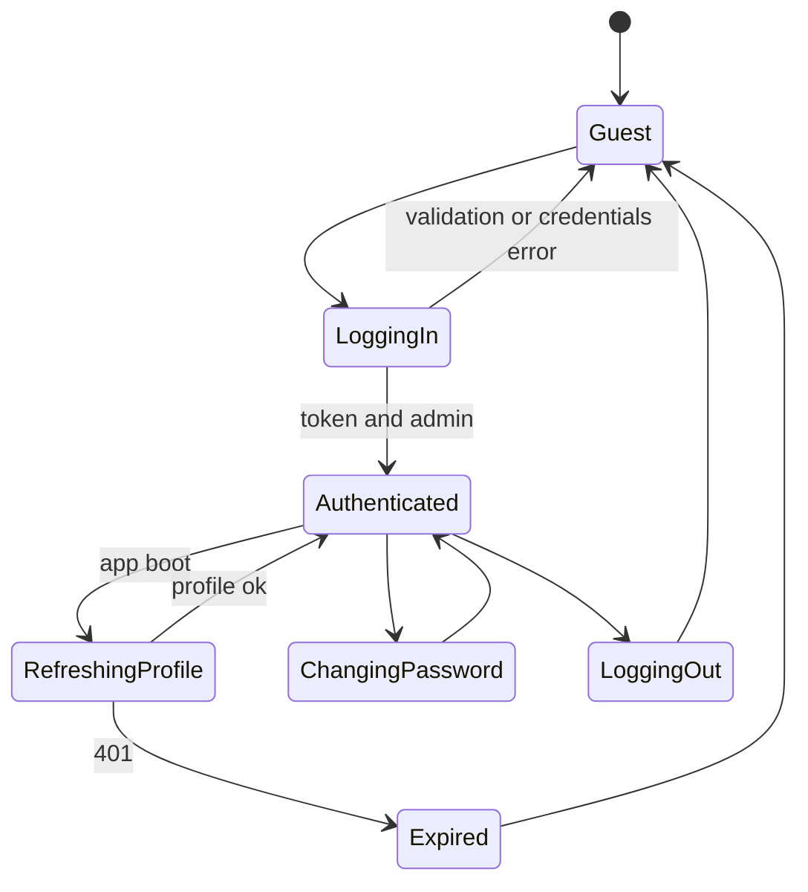
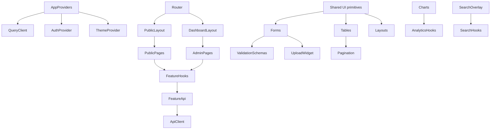
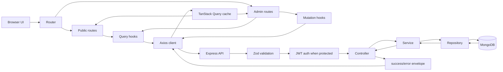
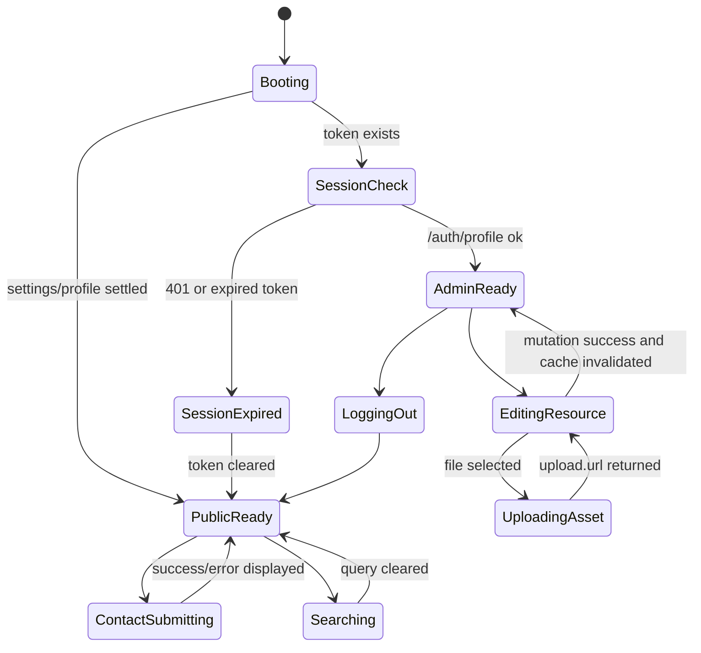

# Portfolio CMS Frontend Architecture - Phase 1

Status: architecture only. No runtime frontend code is changed in this phase.

Source of truth: the supplied HTTP backend contract for
`https://portfolio-server-ten-ecru.vercel.app/api/v1`.

The frontend treats the backend as an external deployed service. It does not
import backend code, copy backend files, or rely on sibling-repo internals.

## Contract Baseline

Base URL: `https://portfolio-server-ten-ecru.vercel.app/api/v1`

Success envelope:

```ts
type ApiSuccess<T> = {
  success: true;
  message: string;
  data: T;
};
```

Error envelope:

```ts
type ApiError = {
  success: false;
  message: string;
  errors: Array<{ field: string; message: string }>;
};
```

Pagination:

```ts
type Pagination = {
  total: number;
  page: number;
  limit: number;
  totalPages: number;
  hasNextPage: boolean;
  hasPrevPage: boolean;
};

type Paginated<T> = {
  items: T[];
  pagination: Pagination;
};
```

## Backend Lifecycle

```txt
HTTP request
  -> Express app
  -> helmet, cors, compression, logger, global rate limit
  -> JSON/urlencoded parser
  -> mongo key sanitizer
  -> /api/v1 module router
  -> route middleware: auth, rate limit, multer, Zod validation
  -> controller
  -> service
  -> repository
  -> Mongoose model
  -> response or error middleware
```

Auth uses JWT bearer tokens. Protected routes require `Authorization: Bearer <accessToken>`. The middleware verifies the token and exposes `req.user.sub` to controllers.

Uploads use memory-backed Multer. The service then validates folder, MIME type, and size, stores locally or in Vercel Blob, and returns an upload record. The frontend must send `multipart/form-data` with fields `file` and `folder`.

Search uses Mongo text indexes. Projects and blogs exclude soft-deleted records; blogs also require `published: true`. Search returns one result bucket per resource type.

Analytics stores event type, optional resource id, hashed IP, and user agent. Profile, project slug, blog slug, and contact submission flows track server-side automatically; explicit public tracking is also available through `POST /analytics/track`. The frontend must not call explicit tracking for auto-tracked profile/project-slug/blog-slug/contact-submit flows, or analytics will be double-counted.

## Resource Relationships



Most relationships are intentionally loose. Uploads provide URLs that are later persisted on resources. Skills relate to projects, experience, and certificates by string names rather than database references. Analytics uses ObjectIds for project/blog resources but returns aggregates, not populated resource documents.

## TypeScript Domain Types

```ts
type Id = string;
type ISODate = string;

type ProjectCategory = "frontend" | "backend" | "fullstack" | "mobile" | "devops" | "ai" | "open-source";
type ProjectStatus = "completed" | "in-progress" | "planned" | "archived";
type SkillCategory = "frontend" | "backend" | "database" | "devops" | "cloud" | "testing" | "tools" | "mobile" | "ai";
type SkillLevel = "beginner" | "intermediate" | "advanced" | "expert";
type EmploymentType = "full-time" | "part-time" | "contract" | "freelance" | "internship";
type ContactStatus = "unread" | "read" | "replied";
type UploadFolder = "profile" | "projects" | "blogs" | "certificates" | "resume";
type SettingsTheme = "light" | "dark" | "system";
type SearchType = "projects" | "blogs" | "skills" | "experience" | "education" | "certificates";
type AnalyticsType = "portfolio_view" | "project_view" | "blog_view" | "contact_submit";

type Admin = {
  _id: Id;
  name: string;
  email: string;
  role: "admin";
  isActive: boolean;
  lastLogin: ISODate | null;
  createdAt: ISODate;
  updatedAt: ISODate;
};

type Profile = {
  _id: Id;
  name: string;
  title: string;
  bio: string;
  shortBio: string;
  email: string;
  phone?: string | null;
  location?: string | null;
  profileImage?: string | null;
  resumeUrl?: string | null;
  availability?: boolean;
  yearsOfExperience: number;
  socialLinks?: { github?: string | null; linkedin?: string | null; portfolio?: string | null; twitter?: string | null };
  createdAt: ISODate;
  updatedAt: ISODate;
};

type Project = {
  _id: Id;
  title: string;
  slug: string;
  description: string;
  shortDescription: string;
  techStack: string[];
  category: ProjectCategory;
  status: ProjectStatus;
  featured: boolean;
  githubUrl?: string | null;
  liveUrl?: string | null;
  thumbnail?: string | null;
  images: string[];
  startDate: ISODate;
  endDate?: ISODate | null;
  createdAt: ISODate;
  updatedAt: ISODate;
};

type Skill = { _id: Id; name: string; category: SkillCategory; level: SkillLevel; yearsOfExperience: number; icon?: string | null; description?: string | null; displayOrder: number; createdAt: ISODate; updatedAt: ISODate };
type Experience = { _id: Id; company: string; position: string; employmentType: EmploymentType; location?: string | null; description: string; responsibilities: string[]; technologies: string[]; startDate: ISODate; endDate?: ISODate | null; isCurrent: boolean; companyLogo?: string | null; createdAt: ISODate; updatedAt: ISODate };
type Education = { _id: Id; degree: string; fieldOfStudy: string; institution: string; description?: string | null; grade?: string | null; startDate: ISODate; endDate?: ISODate | null; isCurrent: boolean; location?: string | null; createdAt: ISODate; updatedAt: ISODate };
type Certificate = { _id: Id; name: string; issuer: string; issueDate: ISODate; expiryDate?: ISODate | null; credentialId?: string | null; credentialUrl?: string | null; description?: string | null; skills: string[]; badgeImage?: string | null; expired?: boolean; createdAt: ISODate; updatedAt: ISODate };
type Blog = { _id: Id; title: string; slug: string; excerpt: string; content: string; coverImage?: string | null; tags: string[]; category: string; featured: boolean; published: boolean; publishedAt?: ISODate | null; seoTitle?: string | null; seoDescription?: string | null; readingTime: number; views: number; createdAt: ISODate; updatedAt: ISODate };
type Contact = { _id: Id; name: string; email: string; subject: string; message: string; status: ContactStatus; isRead: boolean; repliedAt?: ISODate | null; createdAt: ISODate; updatedAt: ISODate };
type Upload = { _id: Id; fileName: string; originalName: string; mimeType: string; size: number; url: string; folder: UploadFolder; uploadedBy?: Id | null; createdAt: ISODate };
type Settings = { siteTitle: string; siteDescription: string; seoTitle: string; seoDescription: string; keywords: string[]; socialLinks: { github?: string; linkedin?: string; twitter?: string; youtube?: string }; theme: SettingsTheme; logo: string; favicon: string; contactEmail: string; contactPhone: string; maintenanceMode: boolean; createdAt?: ISODate; updatedAt?: ISODate };

type AnalyticsOverview = { totalPortfolioViews: number; totalProjectViews: number; totalBlogViews: number; totalContactSubmissions: number; uniqueVisitors: number; thisMonthViews: number };
type ResourceAnalyticsItem = { _id: Id; views: number };
type ContactTimelineItem = { _id: string; count: number };
type MonthlyAnalyticsItem = { _id: string; events: Array<{ type: AnalyticsType; count: number }>; total: number };
type SearchResults = Partial<Record<SearchType, Paginated<Project | Blog | Skill | Experience | Education | Certificate>>>;
```

## Request DTOs

```ts
type LoginRequest = { email: string; password: string };
type ChangePasswordRequest = { currentPassword: string; newPassword: string; confirmNewPassword: string };
type ProfileUpdateRequest = Partial<Pick<Profile, "name" | "title" | "bio" | "shortBio" | "email" | "phone" | "location" | "profileImage" | "resumeUrl" | "availability" | "yearsOfExperience" | "socialLinks">>;
type ProjectCreateRequest = Omit<Project, "_id" | "slug" | "createdAt" | "updatedAt">;
type ProjectUpdateRequest = Partial<ProjectCreateRequest>;
type SkillCreateRequest = Omit<Skill, "_id" | "createdAt" | "updatedAt">;
type SkillUpdateRequest = Partial<SkillCreateRequest>;
type ExperienceCreateRequest = Omit<Experience, "_id" | "createdAt" | "updatedAt">;
type ExperienceUpdateRequest = Partial<ExperienceCreateRequest>;
type EducationCreateRequest = Omit<Education, "_id" | "createdAt" | "updatedAt">;
type EducationUpdateRequest = Partial<EducationCreateRequest>;
type CertificateCreateRequest = Omit<Certificate, "_id" | "expired" | "createdAt" | "updatedAt">;
type CertificateUpdateRequest = Partial<CertificateCreateRequest>;
type BlogCreateRequest = Omit<Blog, "_id" | "slug" | "publishedAt" | "readingTime" | "views" | "createdAt" | "updatedAt">;
type BlogUpdateRequest = Partial<BlogCreateRequest>;
type ContactSubmitRequest = Pick<Contact, "name" | "email" | "subject" | "message">;
type ContactStatusRequest = { status: ContactStatus };
type UploadRequest = { folder: UploadFolder; file: File };
type TrackAnalyticsRequest = { type: AnalyticsType; resourceId?: Id | null };
type SettingsUpdateRequest = Partial<Settings>;
type ListQuery = { page?: number; limit?: number; sort?: string; search?: string };
```

## Validation Architecture

Client schemas should be Zod mirrors of backend schemas, kept feature-local under `features/<name>/validation`. Unknown keys must be rejected to match backend `.strict()`. Server validation still remains authoritative.

Key rules:

- ObjectId: `/^[a-f\d]{24}$/i`.
- Login: email valid/trim/lowercase; password 8-128.
- Change password: current 8-128; new/confirm 8-128 with lowercase, uppercase, number, special char; confirm matches; new differs from current.
- Profile update: at least one field; URL fields valid; `shortBio <= 160`; `yearsOfExperience >= 0`.
- Project create/update: required create fields; `shortDescription <= 200`; non-empty `techStack`; category/status enums; `endDate >= startDate` when both exist.
- Skill: category/level enums; `yearsOfExperience` 0-50; update requires at least one field.
- Experience: employment enum; current entries must not send an end date; `endDate >= startDate`.
- Education: current entries must have null/absent end date; `endDate >= startDate`.
- Certificate: `expiryDate > issueDate` when both exist.
- Blog: excerpt 1-300; SEO title max 60; SEO description max 160; category required string.
- Contact: name 2-100; subject 2-200; message 10-2000; valid email.
- Upload: folder enum; image folders accept jpeg/png/webp and resume accepts PDF.
- Search: `q` min 1; `limit <= 20`; optional type enum.

## Endpoint Contract Matrix

Headers:

- Public GET: `Accept: application/json`.
- JSON mutation: `Accept: application/json`, `Content-Type: application/json`.
- Admin: add `Authorization: Bearer <accessToken>`.
- Upload: admin auth plus browser-generated `multipart/form-data`.

Common error example:

```json
{
  "success": false,
  "message": "Validation failed",
  "errors": [{ "field": "email", "message": "Invalid email" }]
}
```

| Method URL | Purpose | Auth | Body | Params | Query | Success data | Frontend consumption |
| --- | --- | --- | --- | --- | --- | --- | --- |
| `POST /auth/login` | Authenticate admin. | Public JSON | `{ email, password }` | none | none | `{ accessToken, admin }` | Login mutation; store token and admin. |
| `GET /auth/profile` | Fetch current admin. | Admin | none | none | none | `{ admin }` | Session bootstrap and protected routes. |
| `POST /auth/logout` | End local session. | Admin | none | none | none | `{}` | Clear token and cached admin. |
| `PATCH /auth/change-password` | Change password. | Admin JSON | `{ currentPassword, newPassword, confirmNewPassword }` | none | none | `{}` | Account security form. |
| `GET /profile` | Fetch public profile, track portfolio view. | Public | none | none | none | `{ profile }` | Home/about content. |
| `PATCH /profile` | Update singleton profile. | Admin JSON | partial profile, at least one field | none | none | `{ profile }` | Profile editor. |
| `POST /projects` | Create project; slug generated. | Admin JSON | `ProjectCreateRequest` | none | none | `{ project }` | Project create form. |
| `GET /projects` | List non-deleted projects. | Public | none | none | `page`, `limit`, `sort`, `status`, `category`, `featured`, `search` | `{ items, pagination }` | Project index/admin table. |
| `GET /projects/featured` | List featured projects. | Public | none | none | list query | `{ items, pagination }` | Home featured projects. |
| `GET /projects/category/:category` | List by category. | Public | none | `category` enum | service reads `page`, `limit`, `sort` | `{ items, pagination }` | Category route. |
| `GET /projects/slug/:slug` | Fetch by slug, track view. | Public | none | `slug` non-empty | none | `{ project }` | Project detail; avoid eager prefetch. |
| `GET /projects/:id` | Fetch by id. | Public | none | ObjectId | none | `{ project }` | Detail/edit fallback. |
| `PATCH /projects/:id` | Update project. | Admin JSON | partial project, at least one field | ObjectId | none | `{ project }` | Edit form; invalidate lists. |
| `DELETE /projects/:id` | Soft delete project. | Admin | none | ObjectId | none | `{ project }` | Delete action. |
| `POST /skills` | Create skill. | Admin JSON | `SkillCreateRequest` | none | none | `{ skill }` | Skill form. |
| `GET /skills` | List and group skills. | Public | none | none | `page`, `limit`, `category`, `level`, `sort` | `{ items, groupedByCategory, pagination }` | Skill matrix and admin table. |
| `GET /skills/category/:category` | List skills by category. | Public | none | `category` enum | service reads `page`, `limit`, `sort` | `{ items, pagination }` | Skill category view. |
| `GET /skills/:id` | Fetch skill. | Public | none | ObjectId | none | `{ skill }` | Edit load. |
| `PATCH /skills/:id` | Update skill. | Admin JSON | partial skill, at least one field | ObjectId | none | `{ skill }` | Edit form. |
| `DELETE /skills/:id` | Hard delete skill. | Admin | none | ObjectId | none | `{ skill }` | Delete action. |
| `POST /experience` | Create experience. | Admin JSON | `ExperienceCreateRequest` | none | none | `{ experience }` | Experience form. |
| `GET /experience` | List experience. | Public | none | none | `page`, `limit`, `employmentType`, `isCurrent`, `technologies`, `sort` | `{ items, pagination }` | Timeline/admin table. |
| `GET /experience/:id` | Fetch experience. | Public | none | ObjectId | none | `{ experience }` | Edit load. |
| `PATCH /experience/:id` | Update experience. | Admin JSON | partial experience, at least one field | ObjectId | none | `{ experience }` | Edit form. |
| `DELETE /experience/:id` | Hard delete experience. | Admin | none | ObjectId | none | `{ experience }` | Delete action. |
| `POST /education` | Create education. | Admin JSON | `EducationCreateRequest` | none | none | `{ education }` | Education form. |
| `GET /education` | List education. | Public | none | none | `page`, `limit`, `sort`, `search`, `institution`, `isCurrent` | `{ items, pagination }` | Education section/admin table. |
| `GET /education/current` | List current education. | Public | none | none | none | `{ items }` | Home current education. |
| `GET /education/:id` | Fetch education. | Public | none | ObjectId | none | `{ education }` | Edit load. |
| `PATCH /education/:id` | Update education. | Admin JSON | partial education, at least one field | ObjectId | none | `{ education }` | Edit form. |
| `DELETE /education/:id` | Hard delete education. | Admin | none | ObjectId | none | `{ education }` | Delete action. |
| `POST /certificates` | Create certificate. | Admin JSON | `CertificateCreateRequest` | none | none | `{ certificate }` | Certificate form. |
| `GET /certificates` | List certificates. | Public | none | none | `page`, `limit`, `sort`, `search`, `issuer`, `skill`, `expired` | `{ items, pagination }` | Achievements/admin table. |
| `GET /certificates/:id` | Fetch certificate. | Public | none | ObjectId | none | `{ certificate }` | Detail/edit load. |
| `PATCH /certificates/:id` | Update certificate. | Admin JSON | partial certificate, at least one field | ObjectId | none | `{ certificate }` | Edit form. |
| `DELETE /certificates/:id` | Hard delete certificate. | Admin | none | ObjectId | none | `{ certificate }` | Delete action. |
| `POST /blogs` | Create blog post. | Admin JSON | `BlogCreateRequest` | none | none | `{ post }` | Blog editor. |
| `GET /blogs` | List published posts. | Public | none | none | `page`, `limit`, `sort`, `search`, `category`, `featured` | `{ items, pagination }` | Blog index. |
| `GET /blogs/featured` | List featured published posts. | Public | none | none | blog list query | `{ items, pagination }` | Home featured posts. |
| `GET /blogs/category/:category` | List posts by category. | Public | none | `category` non-empty | blog list query | `{ items, pagination }` | Category route. |
| `GET /blogs/tag/:tag` | List posts by tag. | Public | none | `tag` non-empty | blog list query | `{ items, pagination }` | Tag route. |
| `GET /blogs/slug/:slug` | Fetch by slug and track view. | Public | none | `slug` non-empty | none | `{ post }` | Blog detail; avoid eager prefetch. |
| `GET /blogs/:id` | Fetch post by id for admin. | Admin | none | ObjectId | none | `{ post }` | Admin edit unpublished/deleted post. |
| `PATCH /blogs/:id` | Update blog post. | Admin JSON | partial blog, at least one field | ObjectId | none | `{ post }` | Blog editor. |
| `DELETE /blogs/:id` | Soft delete blog post. | Admin | none | ObjectId | none | `{ post }` | Delete action. |
| `POST /contact` | Submit contact form and track analytics. | Public JSON | `{ name, email, subject, message }` | none | none | `{ contact }` | Contact form; surface 429. |
| `GET /contact` | List contact messages. | Admin | none | none | `page`, `limit`, `sort`, `search`, `status`, `isRead` | `{ items, pagination }` | Inbox. |
| `GET /contact/:id` | Fetch and mark read. | Admin | none | ObjectId | none | `{ contact }` | Inbox detail; invalidates unread count. |
| `PATCH /contact/:id` | Update contact status. | Admin JSON | `{ status }` | ObjectId | none | `{ contact }` | Status menu. |
| `DELETE /contact/:id` | Hard delete contact. | Admin | none | ObjectId | none | `{ contact }` | Delete action. |
| `POST /uploads` | Upload file. | Admin multipart | `file`, `folder` | none | none | `{ upload }` | Upload widget with progress. |
| `GET /uploads/:id` | Fetch upload metadata. | Admin | none | ObjectId | none | `{ upload }` | Upload detail/audit. |
| `DELETE /uploads/:id` | Delete file and upload row. | Admin | none | ObjectId | none | `{ upload }` | Asset cleanup. |
| `POST /analytics/track` | Explicit analytics event. | Public JSON | `{ type, resourceId? }` | none | none | `{ event }` | Optional interaction tracking only for events not already auto-tracked by the backend. |
| `GET /analytics/overview` | Fetch KPI overview. | Admin | none | none | none | `AnalyticsOverview` | Dashboard KPI cards. |
| `GET /analytics/monthly` | Fetch monthly aggregates. | Admin | none | none | `months` 1-24 | `{ items }` | Trend chart. |
| `GET /analytics/projects` | Top project view aggregates. | Admin | none | none | none | `{ items: ResourceAnalyticsItem[] }` | Top projects chart. |
| `GET /analytics/blogs` | Top blog view aggregates. | Admin | none | none | none | `{ items: ResourceAnalyticsItem[] }` | Top blogs chart. |
| `GET /analytics/contact` | Contact submission timeline. | Admin | none | none | none | `{ items: ContactTimelineItem[] }` | Timeline chart. |
| `GET /settings` | Fetch public settings/defaults. | Public | none | none | none | `{ settings }` | Theme, SEO, branding bootstrap. |
| `PATCH /settings` | Update settings. | Admin JSON | partial settings, at least one field | none | none | `{ settings }` | Settings form. |
| `GET /search` | Search one/all resources. | Public | none | none | `q`, `type`, `page`, `limit <= 20` | `{ query, results }` | Search overlay/results page. |

Example request and response pattern:

```http
GET /api/v1/projects?page=1&limit=10&category=frontend HTTP/1.1
Accept: application/json
```

```json
{
  "success": true,
  "message": "Projects retrieved successfully",
  "data": {
    "items": [{ "_id": "64f000000000000000000000", "title": "Portfolio CMS", "slug": "portfolio-cms" }],
    "pagination": { "total": 1, "page": 1, "limit": 10, "totalPages": 1, "hasNextPage": false, "hasPrevPage": false }
  }
}
```

For single-resource endpoints, the success payload swaps `items/pagination` for the controller key: `{ profile }`, `{ project }`, `{ skill }`, `{ experience }`, `{ education }`, `{ certificate }`, `{ post }`, `{ contact }`, `{ upload }`, `{ settings }`, `{ admin }`, or `{ event }`.

## Frontend Routes

```txt
/                         public home
/projects                 project index
/projects/category/:cat   project category
/projects/:slug           project detail
/blog                     blog index
/blog/category/:category  blog category
/blog/tag/:tag            blog tag
/blog/:slug               blog detail
/search                   search page
/contact                  contact form
/login                    admin login
/admin                    dashboard
/admin/profile            profile editor
/admin/projects           project table
/admin/projects/new       create project
/admin/projects/:id       edit project
/admin/skills             skills manager
/admin/experience         experience manager
/admin/education          education manager
/admin/certificates       certificates manager
/admin/blogs              blog table
/admin/blogs/new          create blog
/admin/blogs/:id          edit blog
/admin/contact            inbox
/admin/contact/:id        message detail
/admin/uploads            upload manager
/admin/analytics          analytics dashboard
/admin/settings           settings editor
/admin/account            admin profile and password
```

## Frontend Data Flow

```mermaid
flowchart TD
  App --> Settings[GET /settings]
  App --> Profile[GET /profile]
  Home --> FeaturedProjects[GET /projects/featured]
  Home --> Skills[GET /skills]
  Home --> Experience[GET /experience]
  Home --> Education[GET /education]
  Home --> Certificates[GET /certificates]
  Home --> FeaturedBlogs[GET /blogs/featured]
  ProjectDetail --> ProjectSlug[GET /projects/slug/:slug]
  BlogDetail --> BlogSlug[GET /blogs/slug/:slug]
  Login --> Token[Store JWT]
  Token --> AdminProfile[GET /auth/profile]
  AdminDashboard --> Overview[GET /analytics/overview]
  AdminDashboard --> Monthly[GET /analytics/monthly]
  AdminDashboard --> TopProjects[GET /analytics/projects]
  AdminDashboard --> TopBlogs[GET /analytics/blogs]
  AdminDashboard --> ContactTimeline[GET /analytics/contact]
  AdminForms --> Upload[POST /uploads]
  Upload --> SaveResource[POST/PATCH resource with upload.url]
```



Parallel home requests: settings, profile, featured projects, skills, experience, education, certificates, featured blogs. Slug detail endpoints should not be preloaded aggressively because they increment view analytics. Analytics dashboard requests can run in parallel after auth succeeds.

Caching:

- Settings, skills, education, experience, certificates: moderate/long stale times.
- Projects/blogs lists: moderate stale times.
- Analytics/contact inbox: short stale times and refetch on focus.
- Contact inbox can poll while open.

Optimistic candidates: contact status changes and simple skill order/level edits. Deletes should be pessimistic with confirmation because many are hard deletes.

## Auth Flow



Recommended token strategy: `localStorage`, because the backend only provides an access token and no httpOnly cookie or refresh endpoint. On 401, clear token, show a session-expired message, and redirect to `/login?next=<current-path>`. Do not silently fail.

## API Layer Architecture

- Axios instance with `VITE_API_BASE_URL`, defaulting to the production API.
- Request interceptor attaches bearer token.
- Response/error interceptor normalizes backend errors and handles 401 globally.
- Feature API modules own endpoint functions and return typed `data`.
- Query/mutation layer should use TanStack Query after dependency confirmation.
- Retry GET network/5xx once at most; never retry 400/401/403/404/409/429 or uploads automatically.
- Upload helper exposes `uploadFile({ file, folder, onProgress })`.
- Mutation helpers map `errors[]` to form field errors.

## Upload Experience

- Drag/drop and file picker.
- Folder comes from the consuming field, not arbitrary user input.
- MIME and size prevalidation mirrors backend:
  - profile/projects/blogs/certificates: jpeg, png, webp, 5 MB prompt default.
  - resume: PDF, 10 MB prompt default.
- Image preview via object URL; PDF preview via file metadata and optional embedded preview.
- Optional image compression only if output MIME remains allowed.
- Progress via Axios `onUploadProgress`.
- Manual retry only for network/5xx failures.
- On success, write `upload.url` into the target resource field.

## Search Experience

- Debounce by 250-350 ms.
- Trim query; require at least one character.
- Use all-resource `/search?q=term` for overlay and resource-specific `/search?q=term&type=projects` for focused pages.
- Highlight matches client-side without injecting HTML.
- Empty states distinguish start typing, no results, filtered out, and error.
- Each result bucket owns independent pagination.

## Analytics Views

- Overview KPI cards: portfolio views, project views, blog views, contact submissions, unique visitors, this-month views.
- Monthly trend chart: event counts by month and type.
- Top projects/blogs: aggregate bars from resource ids and view counts; optional client-side name join.
- Contact timeline: daily submissions by `_id` date.
- Use skeletons, retained last-good data, and inline retry.

## Settings Behavior

Settings controls theme, SEO metadata, favicon/logo, social links, public contact details, and maintenance mode. Admin routes remain available when public maintenance mode is enabled.

## Component Dependency Diagram



## Feature-First Folder Architecture

```txt
src/
  app/
  api/
    client.ts
    endpoints.ts
    errors.ts
    interceptors.ts
    queryClient.ts
    types.ts
  features/
    auth/
      api/
      components/
      hooks/
      pages/
      services/
      validation/
      constants.ts
      types.ts
      tests/
    profile/
    projects/
    skills/
    experience/
    education/
    certificates/
    blogs/
    contact/
    uploads/
    analytics/
    search/
    settings/
  components/
    ui/
    forms/
    tables/
    charts/
    upload/
    search/
  layouts/
  lib/
  styles/
  tests/
```

## Design System Direction For Phase 2

The interface should feel like a precise portfolio operating system: polished public storytelling and dense, calm admin workflows. It should avoid stock dashboard patterns, nested cards, one-note palettes, and decorative filler.

Phase 2 tokens to define:

- Light and dark semantic colors.
- Typography scale for public narrative and compact admin surfaces.
- 4 px spacing rhythm.
- 6-8 px control/card radius.
- Motion durations: 140-220 ms controls, 260-420 ms page/section reveals.
- Accessible contrast, visible focus rings, full keyboard navigation, reduced-motion support.
- Responsive breakpoints and table/card behavior.

## Confirmation Points Before Implementation

The working agreement requires confirmation before major implementation phases. Recommended decisions to confirm next:

- Add dependencies: `axios`, `@tanstack/react-query`, `react-router-dom`, `react-hook-form`, `zod`, `@hookform/resolvers`, `lucide-react`, and a charting library such as `recharts`.
- Migrate incrementally to TypeScript/TSX, because the requested architecture depends on explicit DTO and response contracts.
- Use `localStorage` for JWT persistence due to the backend JWT-only contract.
- Proceed to Phase 2 design system before runtime page implementation.

## Phase 1 Completion Appendix

This appendix closes the architecture gate from the master prompt. It is deliberately contract-first: every request and response below is derived from backend routes, controllers, validators, models, constants, and response helpers. Example ids use valid ObjectId-shaped placeholders.

Shared example ids:

- `adminId`: `64f000000000000000000001`
- `projectId`: `64f000000000000000000101`
- `skillId`: `64f000000000000000000201`
- `experienceId`: `64f000000000000000000301`
- `educationId`: `64f000000000000000000401`
- `certificateId`: `64f000000000000000000501`
- `blogId`: `64f000000000000000000601`
- `contactId`: `64f000000000000000000701`
- `uploadId`: `64f000000000000000000801`

### Endpoint Example Catalog

All admin examples include `Authorization: Bearer <accessToken>`. JSON mutations include `Content-Type: application/json`. Upload examples let the browser set the multipart boundary.

| Endpoint | Example Request | Example Success Response |
| --- | --- | --- |
| `POST /auth/login` | `POST /api/v1/auth/login` body `{"email":"admin@example.com","password":"<admin-password>"}` | `200 {"success":true,"message":"Login successful","data":{"accessToken":"<jwt-access-token>","admin":{"_id":"64f000000000000000000001","name":"Admin","email":"admin@example.com","role":"admin","isActive":true,"lastLogin":"2026-07-18T08:00:00.000Z","createdAt":"2026-01-01T00:00:00.000Z","updatedAt":"2026-07-18T08:00:00.000Z"}}}` |
| `GET /auth/profile` | `GET /api/v1/auth/profile` | `200 {"success":true,"message":"Profile fetched successfully","data":{"admin":{"_id":"64f000000000000000000001","name":"Admin","email":"admin@example.com","role":"admin","isActive":true,"lastLogin":"2026-07-18T08:00:00.000Z"}}}` |
| `POST /auth/logout` | `POST /api/v1/auth/logout` | `200 {"success":true,"message":"Logout successful","data":{}}` |
| `PATCH /auth/change-password` | `PATCH /api/v1/auth/change-password` body `{"currentPassword":"<current-password>","newPassword":"<new-strong-password>","confirmNewPassword":"<new-strong-password>"}` | `200 {"success":true,"message":"Password changed successfully","data":{}}` |
| `GET /profile` | `GET /api/v1/profile` | `200 {"success":true,"message":"Profile fetched successfully","data":{"profile":{"_id":"64f000000000000000000901","name":"Muhammad Umar","title":"Full Stack Developer","bio":"I build production web systems.","shortBio":"Full Stack Developer","email":"umar@example.com","phone":"+923001234567","location":"Karachi, Pakistan","profileImage":"https://cdn.example.com/profile.jpg","resumeUrl":"https://cdn.example.com/resume.pdf","availability":true,"yearsOfExperience":5,"socialLinks":{"github":"https://github.com/username","linkedin":"https://linkedin.com/in/username","portfolio":"https://username.dev","twitter":"https://twitter.com/username"},"createdAt":"2026-01-01T00:00:00.000Z","updatedAt":"2026-07-18T08:00:00.000Z"}}}` |
| `PATCH /profile` | `PATCH /api/v1/profile` body `{"title":"Senior Full Stack Developer","availability":true}` | `200 {"success":true,"message":"Profile updated successfully","data":{"profile":{"_id":"64f000000000000000000901","title":"Senior Full Stack Developer","availability":true}}}` |
| `GET /projects` | `GET /api/v1/projects?page=1&limit=10&sort=-createdAt&category=fullstack&status=completed&featured=true&search=cms` | `200 {"success":true,"message":"Projects retrieved successfully","data":{"items":[{"_id":"64f000000000000000000101","title":"Portfolio CMS","slug":"portfolio-cms","shortDescription":"Portfolio management system","techStack":["React","Node.js"],"category":"fullstack","status":"completed","featured":true}],"pagination":{"total":1,"page":1,"limit":10,"totalPages":1,"hasNextPage":false,"hasPrevPage":false}}}` |
| `GET /projects/featured` | `GET /api/v1/projects/featured?page=1&limit=6` | `200 {"success":true,"message":"Projects retrieved successfully","data":{"items":[{"_id":"64f000000000000000000101","title":"Portfolio CMS","slug":"portfolio-cms","featured":true}],"pagination":{"total":1,"page":1,"limit":6,"totalPages":1,"hasNextPage":false,"hasPrevPage":false}}}` |
| `GET /projects/category/:category` | `GET /api/v1/projects/category/fullstack?page=1&limit=9` | `200 {"success":true,"message":"Projects retrieved successfully","data":{"items":[{"_id":"64f000000000000000000101","title":"Portfolio CMS","category":"fullstack"}],"pagination":{"total":1,"page":1,"limit":9,"totalPages":1,"hasNextPage":false,"hasPrevPage":false}}}` |
| `GET /projects/slug/:slug` | `GET /api/v1/projects/slug/portfolio-cms` | `200 {"success":true,"message":"Project retrieved successfully","data":{"project":{"_id":"64f000000000000000000101","title":"Portfolio CMS","slug":"portfolio-cms","description":"Full description","shortDescription":"Portfolio management system","techStack":["React","Node.js"],"category":"fullstack","status":"completed","featured":true,"githubUrl":"https://github.com/user/repo","liveUrl":"https://example.com","thumbnail":"https://cdn.example.com/project.jpg","images":["https://cdn.example.com/project-2.jpg"],"startDate":"2026-01-01T00:00:00.000Z","endDate":"2026-06-01T00:00:00.000Z","createdAt":"2026-01-01T00:00:00.000Z","updatedAt":"2026-07-18T08:00:00.000Z"}}}` |
| `GET /projects/:id` | `GET /api/v1/projects/64f000000000000000000101` | `200 {"success":true,"message":"Project retrieved successfully","data":{"project":{"_id":"64f000000000000000000101","title":"Portfolio CMS","slug":"portfolio-cms"}}}` |
| `POST /projects` | `POST /api/v1/projects` body `{"title":"Portfolio CMS","description":"Full description","shortDescription":"Portfolio management system","techStack":["React","Node.js"],"category":"fullstack","status":"completed","featured":true,"githubUrl":"https://github.com/user/repo","liveUrl":"https://example.com","thumbnail":"https://cdn.example.com/project.jpg","images":["https://cdn.example.com/project-2.jpg"],"startDate":"2026-01-01","endDate":"2026-06-01"}` | `201 {"success":true,"message":"Project created successfully","data":{"project":{"_id":"64f000000000000000000101","title":"Portfolio CMS","slug":"portfolio-cms"}}}` |
| `PATCH /projects/:id` | `PATCH /api/v1/projects/64f000000000000000000101` body `{"featured":false,"status":"archived"}` | `200 {"success":true,"message":"Project updated successfully","data":{"project":{"_id":"64f000000000000000000101","featured":false,"status":"archived"}}}` |
| `DELETE /projects/:id` | `DELETE /api/v1/projects/64f000000000000000000101` | `200 {"success":true,"message":"Project deleted successfully","data":{"project":{"_id":"64f000000000000000000101","title":"Portfolio CMS"}}}` |
| `GET /skills` | `GET /api/v1/skills?page=1&limit=20&category=frontend&level=advanced&sort=displayOrder` | `200 {"success":true,"message":"Skills retrieved successfully","data":{"items":[{"_id":"64f000000000000000000201","name":"React","category":"frontend","level":"advanced","yearsOfExperience":4,"displayOrder":1}],"groupedByCategory":{"frontend":[{"_id":"64f000000000000000000201","name":"React"}]},"pagination":{"total":1,"page":1,"limit":20,"totalPages":1,"hasNextPage":false,"hasPrevPage":false}}}` |
| `GET /skills/category/:category` | `GET /api/v1/skills/category/frontend?page=1&limit=20` | `200 {"success":true,"message":"Skills retrieved successfully","data":{"items":[{"_id":"64f000000000000000000201","name":"React","category":"frontend"}],"pagination":{"total":1,"page":1,"limit":20,"totalPages":1,"hasNextPage":false,"hasPrevPage":false}}}` |
| `GET /skills/:id` | `GET /api/v1/skills/64f000000000000000000201` | `200 {"success":true,"message":"Skill retrieved successfully","data":{"skill":{"_id":"64f000000000000000000201","name":"React","category":"frontend","level":"advanced","yearsOfExperience":4,"icon":"https://cdn.example.com/react.svg","description":"UI library","displayOrder":1}}}` |
| `POST /skills` | `POST /api/v1/skills` body `{"name":"React","category":"frontend","level":"advanced","yearsOfExperience":4,"icon":"https://cdn.example.com/react.svg","description":"UI library","displayOrder":1}` | `201 {"success":true,"message":"Skill created successfully","data":{"skill":{"_id":"64f000000000000000000201","name":"React"}}}` |
| `PATCH /skills/:id` | `PATCH /api/v1/skills/64f000000000000000000201` body `{"level":"expert","displayOrder":0}` | `200 {"success":true,"message":"Skill updated successfully","data":{"skill":{"_id":"64f000000000000000000201","level":"expert","displayOrder":0}}}` |
| `DELETE /skills/:id` | `DELETE /api/v1/skills/64f000000000000000000201` | `200 {"success":true,"message":"Skill deleted successfully","data":{"skill":{"_id":"64f000000000000000000201","name":"React"}}}` |
| `GET /experience` | `GET /api/v1/experience?page=1&limit=10&employmentType=full-time&isCurrent=true&technologies=React&sort=-startDate` | `200 {"success":true,"message":"Experience entries retrieved successfully","data":{"items":[{"_id":"64f000000000000000000301","company":"Tech Corp","position":"Senior Developer","employmentType":"full-time","isCurrent":true}],"pagination":{"total":1,"page":1,"limit":10,"totalPages":1,"hasNextPage":false,"hasPrevPage":false}}}` |
| `GET /experience/:id` | `GET /api/v1/experience/64f000000000000000000301` | `200 {"success":true,"message":"Experience entry retrieved successfully","data":{"experience":{"_id":"64f000000000000000000301","company":"Tech Corp","position":"Senior Developer","employmentType":"full-time","location":"Karachi, Pakistan","description":"Leading frontend team","responsibilities":["Led team"],"technologies":["React","TypeScript"],"startDate":"2023-01-01T00:00:00.000Z","endDate":null,"isCurrent":true,"companyLogo":"https://cdn.example.com/logo.png"}}}` |
| `POST /experience` | `POST /api/v1/experience` body `{"company":"Tech Corp","position":"Senior Developer","employmentType":"full-time","location":"Karachi, Pakistan","description":"Leading frontend team","responsibilities":["Led team"],"technologies":["React","TypeScript"],"startDate":"2023-01-01","endDate":null,"isCurrent":true,"companyLogo":"https://cdn.example.com/logo.png"}` | `201 {"success":true,"message":"Experience entry created successfully","data":{"experience":{"_id":"64f000000000000000000301","company":"Tech Corp","position":"Senior Developer"}}}` |
| `PATCH /experience/:id` | `PATCH /api/v1/experience/64f000000000000000000301` body `{"position":"Staff Frontend Engineer"}` | `200 {"success":true,"message":"Experience entry updated successfully","data":{"experience":{"_id":"64f000000000000000000301","position":"Staff Frontend Engineer"}}}` |
| `DELETE /experience/:id` | `DELETE /api/v1/experience/64f000000000000000000301` | `200 {"success":true,"message":"Experience entry deleted successfully","data":{"experience":{"_id":"64f000000000000000000301","company":"Tech Corp"}}}` |
| `GET /education` | `GET /api/v1/education?page=1&limit=10&search=computer&institution=University&isCurrent=false&sort=-startDate` | `200 {"success":true,"message":"Education listed","data":{"items":[{"_id":"64f000000000000000000401","degree":"Bachelor of Science","fieldOfStudy":"Computer Science","institution":"University of Karachi"}],"pagination":{"total":1,"page":1,"limit":10,"totalPages":1,"hasNextPage":false,"hasPrevPage":false}}}` |
| `GET /education/current` | `GET /api/v1/education/current` | `200 {"success":true,"message":"Education listed","data":{"items":[{"_id":"64f000000000000000000401","degree":"MS","institution":"Example University","isCurrent":true}]}}` |
| `GET /education/:id` | `GET /api/v1/education/64f000000000000000000401` | `200 {"success":true,"message":"Education fetched","data":{"education":{"_id":"64f000000000000000000401","degree":"Bachelor of Science","fieldOfStudy":"Computer Science","institution":"University of Karachi","description":"Software engineering focus","grade":"A","startDate":"2018-09-01T00:00:00.000Z","endDate":"2022-06-01T00:00:00.000Z","isCurrent":false,"location":"Karachi, Pakistan"}}}` |
| `POST /education` | `POST /api/v1/education` body `{"degree":"Bachelor of Science","fieldOfStudy":"Computer Science","institution":"University of Karachi","description":"Software engineering focus","grade":"A","startDate":"2018-09-01","endDate":"2022-06-01","isCurrent":false,"location":"Karachi, Pakistan"}` | `201 {"success":true,"message":"Education created","data":{"education":{"_id":"64f000000000000000000401","degree":"Bachelor of Science"}}}` |
| `PATCH /education/:id` | `PATCH /api/v1/education/64f000000000000000000401` body `{"grade":"A+"}` | `200 {"success":true,"message":"Education updated","data":{"education":{"_id":"64f000000000000000000401","grade":"A+"}}}` |
| `DELETE /education/:id` | `DELETE /api/v1/education/64f000000000000000000401` | `200 {"success":true,"message":"Education deleted","data":{"education":{"_id":"64f000000000000000000401","degree":"Bachelor of Science"}}}` |
| `GET /certificates` | `GET /api/v1/certificates?page=1&limit=10&search=aws&issuer=Amazon&skill=cloud&expired=false&sort=-issueDate` | `200 {"success":true,"message":"Certificates listed","data":{"items":[{"_id":"64f000000000000000000501","name":"AWS Developer","issuer":"Amazon","expired":false}],"pagination":{"total":1,"page":1,"limit":10,"totalPages":1,"hasNextPage":false,"hasPrevPage":false}}}` |
| `GET /certificates/:id` | `GET /api/v1/certificates/64f000000000000000000501` | `200 {"success":true,"message":"Certificate fetched","data":{"certificate":{"_id":"64f000000000000000000501","name":"AWS Developer","issuer":"Amazon","issueDate":"2025-01-01T00:00:00.000Z","expiryDate":"2028-01-01T00:00:00.000Z","credentialId":"ABC-123","credentialUrl":"https://example.com/verify","description":"Cloud certification","skills":["AWS","Cloud"],"badgeImage":"https://cdn.example.com/aws.png","expired":false}}}` |
| `POST /certificates` | `POST /api/v1/certificates` body `{"name":"AWS Developer","issuer":"Amazon","issueDate":"2025-01-01","expiryDate":"2028-01-01","credentialId":"ABC-123","credentialUrl":"https://example.com/verify","description":"Cloud certification","skills":["AWS","Cloud"],"badgeImage":"https://cdn.example.com/aws.png"}` | `201 {"success":true,"message":"Certificate created","data":{"certificate":{"_id":"64f000000000000000000501","name":"AWS Developer"}}}` |
| `PATCH /certificates/:id` | `PATCH /api/v1/certificates/64f000000000000000000501` body `{"description":"Updated certification notes"}` | `200 {"success":true,"message":"Certificate updated","data":{"certificate":{"_id":"64f000000000000000000501","description":"Updated certification notes"}}}` |
| `DELETE /certificates/:id` | `DELETE /api/v1/certificates/64f000000000000000000501` | `200 {"success":true,"message":"Certificate deleted","data":{"certificate":{"_id":"64f000000000000000000501","name":"AWS Developer"}}}` |
| `GET /blogs` | `GET /api/v1/blogs?page=1&limit=10&search=react&category=frontend&featured=true&sort=-publishedAt` | `200 {"success":true,"message":"Blog posts listed","data":{"items":[{"_id":"64f000000000000000000601","title":"React Architecture","slug":"react-architecture","excerpt":"How to structure React apps","category":"frontend","featured":true,"published":true}],"pagination":{"total":1,"page":1,"limit":10,"totalPages":1,"hasNextPage":false,"hasPrevPage":false}}}` |
| `GET /blogs/featured` | `GET /api/v1/blogs/featured?page=1&limit=3` | `200 {"success":true,"message":"Blog posts listed","data":{"items":[{"_id":"64f000000000000000000601","title":"React Architecture","slug":"react-architecture","featured":true}],"pagination":{"total":1,"page":1,"limit":3,"totalPages":1,"hasNextPage":false,"hasPrevPage":false}}}` |
| `GET /blogs/category/:category` | `GET /api/v1/blogs/category/frontend?page=1&limit=10` | `200 {"success":true,"message":"Blog posts listed","data":{"items":[{"_id":"64f000000000000000000601","title":"React Architecture","category":"frontend"}],"pagination":{"total":1,"page":1,"limit":10,"totalPages":1,"hasNextPage":false,"hasPrevPage":false}}}` |
| `GET /blogs/tag/:tag` | `GET /api/v1/blogs/tag/react?page=1&limit=10` | `200 {"success":true,"message":"Blog posts listed","data":{"items":[{"_id":"64f000000000000000000601","title":"React Architecture","tags":["react","architecture"]}],"pagination":{"total":1,"page":1,"limit":10,"totalPages":1,"hasNextPage":false,"hasPrevPage":false}}}` |
| `GET /blogs/slug/:slug` | `GET /api/v1/blogs/slug/react-architecture` | `200 {"success":true,"message":"Blog post fetched","data":{"post":{"_id":"64f000000000000000000601","title":"React Architecture","slug":"react-architecture","excerpt":"How to structure React apps","content":"Long-form article content","coverImage":"https://cdn.example.com/blog.jpg","tags":["react","architecture"],"category":"frontend","featured":true,"published":true,"publishedAt":"2026-07-01T00:00:00.000Z","seoTitle":"React Architecture","seoDescription":"React architecture guide","readingTime":6,"views":42}}}` |
| `GET /blogs/:id` | `GET /api/v1/blogs/64f000000000000000000601` | `200 {"success":true,"message":"Blog post fetched","data":{"post":{"_id":"64f000000000000000000601","title":"React Architecture","published":false}}}` |
| `POST /blogs` | `POST /api/v1/blogs` body `{"title":"React Architecture","excerpt":"How to structure React apps","content":"Long-form article content","coverImage":"https://cdn.example.com/blog.jpg","tags":["react","architecture"],"category":"frontend","featured":true,"published":true,"seoTitle":"React Architecture","seoDescription":"React architecture guide"}` | `201 {"success":true,"message":"Blog post created","data":{"post":{"_id":"64f000000000000000000601","title":"React Architecture","slug":"react-architecture"}}}` |
| `PATCH /blogs/:id` | `PATCH /api/v1/blogs/64f000000000000000000601` body `{"featured":false,"published":false}` | `200 {"success":true,"message":"Blog post updated","data":{"post":{"_id":"64f000000000000000000601","featured":false,"published":false}}}` |
| `DELETE /blogs/:id` | `DELETE /api/v1/blogs/64f000000000000000000601` | `200 {"success":true,"message":"Blog post deleted","data":{"post":{"_id":"64f000000000000000000601","title":"React Architecture"}}}` |
| `POST /contact` | `POST /api/v1/contact` body `{"name":"Jane Recruiter","email":"jane@example.com","subject":"Interview","message":"I would like to discuss a role with you."}` | `201 {"success":true,"message":"Contact submitted","data":{"contact":{"_id":"64f000000000000000000701","name":"Jane Recruiter","email":"jane@example.com","subject":"Interview","message":"I would like to discuss a role with you.","status":"unread","isRead":false}}}` |
| `GET /contact` | `GET /api/v1/contact?page=1&limit=20&status=unread&isRead=false&search=jane&sort=-createdAt` | `200 {"success":true,"message":"Contacts listed","data":{"items":[{"_id":"64f000000000000000000701","name":"Jane Recruiter","email":"jane@example.com","subject":"Interview","status":"unread","isRead":false}],"pagination":{"total":1,"page":1,"limit":20,"totalPages":1,"hasNextPage":false,"hasPrevPage":false}}}` |
| `GET /contact/:id` | `GET /api/v1/contact/64f000000000000000000701` | `200 {"success":true,"message":"Contact fetched","data":{"contact":{"_id":"64f000000000000000000701","name":"Jane Recruiter","email":"jane@example.com","subject":"Interview","message":"I would like to discuss a role with you.","status":"read","isRead":true,"repliedAt":null}}}` |
| `PATCH /contact/:id` | `PATCH /api/v1/contact/64f000000000000000000701` body `{"status":"replied"}` | `200 {"success":true,"message":"Contact updated","data":{"contact":{"_id":"64f000000000000000000701","status":"replied","isRead":true,"repliedAt":"2026-07-18T08:00:00.000Z"}}}` |
| `DELETE /contact/:id` | `DELETE /api/v1/contact/64f000000000000000000701` | `200 {"success":true,"message":"Contact deleted","data":{"contact":{"_id":"64f000000000000000000701","email":"jane@example.com"}}}` |
| `POST /uploads` | `POST /api/v1/uploads` multipart fields `folder=projects`, `file=@project.png` | `201 {"success":true,"message":"File uploaded","data":{"upload":{"_id":"64f000000000000000000801","fileName":"uuid-project.png","originalName":"project.png","mimeType":"image/png","size":123456,"url":"https://cdn.example.com/uploads/projects/uuid-project.png","folder":"projects","uploadedBy":"64f000000000000000000001","createdAt":"2026-07-18T08:00:00.000Z"}}}` |
| `GET /uploads/:id` | `GET /api/v1/uploads/64f000000000000000000801` | `200 {"success":true,"message":"Upload fetched","data":{"upload":{"_id":"64f000000000000000000801","fileName":"uuid-project.png","originalName":"project.png","mimeType":"image/png","size":123456,"url":"https://cdn.example.com/uploads/projects/uuid-project.png","folder":"projects"}}}` |
| `DELETE /uploads/:id` | `DELETE /api/v1/uploads/64f000000000000000000801` | `200 {"success":true,"message":"File deleted","data":{"upload":{"_id":"64f000000000000000000801","url":"https://cdn.example.com/uploads/projects/uuid-project.png"}}}` |
| `POST /analytics/track` | `POST /api/v1/analytics/track` body `{"type":"project_view","resourceId":"64f000000000000000000101"}` | `201 {"success":true,"message":"Analytics event tracked","data":{"event":{"_id":"64f000000000000000000a01","type":"project_view","resourceId":"64f000000000000000000101","userAgent":"Mozilla/5.0","createdAt":"2026-07-18T08:00:00.000Z"}}}` |
| `GET /analytics/overview` | `GET /api/v1/analytics/overview` | `200 {"success":true,"message":"Analytics overview","data":{"totalPortfolioViews":1000,"totalProjectViews":420,"totalBlogViews":260,"totalContactSubmissions":12,"uniqueVisitors":700,"thisMonthViews":90}}` |
| `GET /analytics/monthly` | `GET /api/v1/analytics/monthly?months=6` | `200 {"success":true,"message":"Monthly analytics report","data":{"items":[{"_id":"2026-07","events":[{"type":"portfolio_view","count":40},{"type":"project_view","count":30}],"total":70}]}}` |
| `GET /analytics/projects` | `GET /api/v1/analytics/projects` | `200 {"success":true,"message":"Project analytics","data":{"items":[{"_id":"64f000000000000000000101","views":120}]}}` |
| `GET /analytics/blogs` | `GET /api/v1/analytics/blogs` | `200 {"success":true,"message":"Blog analytics","data":{"items":[{"_id":"64f000000000000000000601","views":80}]}}` |
| `GET /analytics/contact` | `GET /api/v1/analytics/contact` | `200 {"success":true,"message":"Contact analytics","data":{"items":[{"_id":"2026-07-18","count":3}]}}` |
| `GET /settings` | `GET /api/v1/settings` | `200 {"success":true,"message":"Settings fetched","data":{"settings":{"siteTitle":"Portfolio","siteDescription":"Personal portfolio","seoTitle":"Muhammad Umar Portfolio","seoDescription":"Full stack portfolio","keywords":["react","node"],"socialLinks":{"github":"https://github.com/username","linkedin":"https://linkedin.com/in/username","twitter":"","youtube":""},"theme":"system","logo":"","favicon":"","contactEmail":"umar@example.com","contactPhone":"+923001234567","maintenanceMode":false}}}` |
| `PATCH /settings` | `PATCH /api/v1/settings` body `{"siteTitle":"Muhammad Umar","theme":"dark","maintenanceMode":false}` | `200 {"success":true,"message":"Settings updated","data":{"settings":{"siteTitle":"Muhammad Umar","theme":"dark","maintenanceMode":false}}}` |
| `GET /search` | `GET /api/v1/search?q=react&type=projects&page=1&limit=10` | `200 {"success":true,"message":"Search results","data":{"query":"react","results":{"projects":{"items":[{"_id":"64f000000000000000000101","title":"React Portfolio","slug":"react-portfolio"}],"pagination":{"total":1,"page":1,"limit":10,"totalPages":1,"hasNextPage":false,"hasPrevPage":false}}}}}` |

Common error response for any validation failure:

```json
{
  "success": false,
  "message": "Validation failed",
  "errors": [{ "field": "email", "message": "Invalid email" }]
}
```

### Full API Mapping Table

| Feature | Public Reads | Admin Mutations/Reads | Frontend Consumers |
| --- | --- | --- | --- |
| Auth | none | login, logout, profile, change password | `AuthProvider`, login page, account page, protected route guard |
| Profile | `GET /profile` | `PATCH /profile` | home hero/about/contact CTA, admin profile editor |
| Projects | list, featured, category, slug, id | create, update, soft delete | home featured work, project index/detail, admin project table/form |
| Skills | list/grouped, category, id | create, update, delete | home skill matrix, admin skill manager |
| Experience | list, id | create, update, delete | public timeline, admin experience manager |
| Education | list, current, id | create, update, delete | education section, admin education manager |
| Certificates | list, id | create, update, delete | achievements section, admin certificates manager |
| Blogs | published list, featured, category, tag, slug | create, read by id, update, soft delete | blog index/detail, admin blog editor |
| Contact | submit | list, detail, status update, delete | public contact form, admin inbox |
| Uploads | none | upload, read metadata, delete | all admin media fields and upload manager |
| Analytics | explicit track | overview, monthly, top projects, top blogs, contact timeline | admin dashboard charts |
| Settings | `GET /settings` | `PATCH /settings` | app bootstrap, theme, SEO, branding, maintenance mode |
| Search | `GET /search` | none | global command/search overlay, search results page |

### Data Flow Diagram



### State Flow Diagram



### Implementation-Phase Risk Register

| Risk | Frontend Decision |
| --- | --- |
| Backend request validators are strict. | Feature schemas must reject unknown keys before submit. |
| Slug detail reads increment views. | Do not prefetch project/blog slug pages from hover or viewport-only links. |
| Some deletes are hard deletes and some are soft deletes. | Require confirmation for all deletes; copy should avoid promising recovery. |
| Upload constraints are folder-dependent. | Upload component must receive a folder prop from the parent resource field. |
| No refresh token endpoint exists. | Treat 401 as session expiry, clear token, redirect to login with `next`. |
| Contact route is tightly rate-limited. | Never automatic-retry 429; show a clear retry-later message. |
| Backend is JavaScript while prompt asks for TypeScript contracts. | Phase 3 should introduce TS incrementally after dependency/type migration confirmation. |

## Contract-First Endpoint Detail Addendum

This addendum completes the endpoint-by-endpoint contract view requested for the
architecture gate. It should be read with the example catalog above: every route
below has a matching example request and success response in the catalog.

Common headers:

- Public JSON reads: `Accept: application/json`.
- Public JSON mutations: `Accept: application/json`, `Content-Type: application/json`.
- Admin JSON reads/mutations: public JSON headers plus `Authorization: Bearer <accessToken>`.
- Uploads: `Authorization: Bearer <accessToken>` and browser-generated `multipart/form-data`.

Common errors:

- Validation errors use `success: false`, a human `message`, and `errors[]`.
- `401` clears the token and redirects to login with `next`.
- `403` is shown as an authorization failure.
- `404` is rendered as a missing resource state.
- `429` is surfaced clearly and never retried automatically.
- `5xx` can be retried once for idempotent GET requests only.

### Auth Endpoints

| Method URL | Auth | Body | Params | Query | Validation | Success shape | Frontend consumption |
| --- | --- | --- | --- | --- | --- | --- | --- |
| `POST /auth/login` | Public | `email`, `password` | none | none | Valid email; password present and within server length rules. | `{ accessToken, admin }` | Login mutation stores token, primes admin cache, redirects to `next` or `/admin`. |
| `GET /auth/profile` | Admin | none | none | none | Bearer token must be valid and unexpired. | `{ admin }` | App/session bootstrap and protected route guard. |
| `POST /auth/logout` | Admin | none | none | none | Bearer token if available; no refresh/session invalidation exists. | `{}` | Clears token, admin cache, protected query data, and routes to login/home. |
| `PATCH /auth/change-password` | Admin | `currentPassword`, `newPassword`, `confirmNewPassword` | none | none | Current password required; new password and confirmation match; mirror backend password strength exactly once confirmed. | `{}` | Account page mutation; field errors mapped from `errors[]`; token remains unless API returns 401. |

### Profile Endpoints

| Method URL | Auth | Body | Params | Query | Validation | Success shape | Frontend consumption |
| --- | --- | --- | --- | --- | --- | --- | --- |
| `GET /profile` | Public | none | none | none | None client-side. Backend auto-tracks `portfolio_view`. | `{ profile }` | Public bootstrap/home content; do not also call `/analytics/track` for this view. |
| `PATCH /profile` | Admin | Partial profile | none | none | Send only changed fields; fields limited to contract; email valid; `availability` boolean; `yearsOfExperience` number; `socialLinks` keys limited to github/linkedin/portfolio/twitter. | `{ profile }` | Admin singleton form; invalidate public profile and admin profile editor queries. |

### Project Endpoints

| Method URL | Auth | Body | Params | Query | Validation | Success shape | Frontend consumption |
| --- | --- | --- | --- | --- | --- | --- | --- |
| `GET /projects` | Public | none | none | `page`, `limit`, `sort`, `status`, `category`, `featured`, `search` | `status` and `category` enums; `featured` boolean-like; pagination positive. | `{ items, pagination }` | Project index and admin table; cache by query params. |
| `GET /projects/featured` | Public | none | none | Optional pagination/sort per list behavior | Featured is implied by route. | `{ items, pagination }` | Home featured projects; medium cache. |
| `GET /projects/category/:category` | Public | none | `category` | Optional pagination/sort | Category must be one of `frontend`, `backend`, `fullstack`, `mobile`, `devops`, `ai`, `open-source`. | `{ items, pagination }` | Category page; category comes from route param and is validated before request. |
| `GET /projects/slug/:slug` | Public | none | `slug` | none | Non-empty slug. Backend tracks view. | `{ project }` | Project detail; no hover/viewport prefetch to avoid false view counts. |
| `GET /projects/:id` | Public | none | `id` | none | ObjectId-shaped id. | `{ project }` | Detail fallback and admin edit load when slug is unavailable. |
| `POST /projects` | Admin | Project create fields | none | none | Required: `title`, `description`, `shortDescription`, `techStack`, `category`, `status`, `startDate`; enums as above; arrays are arrays; `featured` boolean; URL fields valid when present; end date cannot precede start date. | `{ project }` | Project create form; upload first, then persist returned URLs. |
| `PATCH /projects/:id` | Admin | Partial project | `id` | none | ObjectId id; at least one changed field; same field rules as create for included keys only. | `{ project }` | Project edit form; invalidate project lists, featured list, detail. |
| `DELETE /projects/:id` | Admin | none | `id` | none | ObjectId id. | `{ project }` | Soft delete with confirmation; pessimistic mutation. |

### Skill Endpoints

| Method URL | Auth | Body | Params | Query | Validation | Success shape | Frontend consumption |
| --- | --- | --- | --- | --- | --- | --- | --- |
| `GET /skills` | Public | none | none | `page`, `limit`, `category`, `level`, `sort` | Category and level enums; pagination positive. | `{ items, pagination }`, optionally grouped skill data if returned | Public skill matrix and admin table. |
| `GET /skills/category/:category` | Public | none | `category` | Optional pagination/sort | Category enum: `frontend`, `backend`, `database`, `devops`, `cloud`, `testing`, `tools`, `mobile`, `ai`. | `{ items, pagination }` | Focused category view. |
| `GET /skills/:id` | Public | none | `id` | none | ObjectId-shaped id. | `{ skill }` | Admin edit load. |
| `POST /skills` | Admin | Skill create fields | none | none | Required: `name`, `category`, `level`, `yearsOfExperience`, `displayOrder`; category/level enums; numeric fields are numbers; optional `icon`, `description`. | `{ skill }` | Skill create form. |
| `PATCH /skills/:id` | Admin | Partial skill | `id` | none | ObjectId id; at least one changed field; same included-key rules as create. | `{ skill }` | Skill edit; invalidate skills lists. |
| `DELETE /skills/:id` | Admin | none | `id` | none | ObjectId id. | `{ skill }` | Confirmed delete; pessimistic mutation. |

### Experience Endpoints

| Method URL | Auth | Body | Params | Query | Validation | Success shape | Frontend consumption |
| --- | --- | --- | --- | --- | --- | --- | --- |
| `GET /experience` | Public | none | none | `page`, `limit`, `employmentType`, `isCurrent`, `technologies`, `sort` | Employment enum; `isCurrent` boolean-like; `technologies` filter string/list as API expects. | `{ items, pagination }` | Public timeline and admin table; cache by query. |
| `GET /experience/:id` | Public | none | `id` | none | ObjectId-shaped id. | `{ experience }` | Admin edit load. |
| `POST /experience` | Admin | Experience create fields | none | none | Required: `company`, `position`, `employmentType`, `description`, `responsibilities`, `technologies`, `startDate`, `isCurrent`; employment enum; arrays are arrays; current roles should not require end date; end date cannot precede start date. | `{ experience }` | Experience form. |
| `PATCH /experience/:id` | Admin | Partial experience | `id` | none | ObjectId id; at least one changed field; same included-key rules as create. | `{ experience }` | Edit form; invalidate timelines. |
| `DELETE /experience/:id` | Admin | none | `id` | none | ObjectId id. | `{ experience }` | Confirmed hard delete. |

### Education Endpoints

| Method URL | Auth | Body | Params | Query | Validation | Success shape | Frontend consumption |
| --- | --- | --- | --- | --- | --- | --- | --- |
| `GET /education` | Public | none | none | `page`, `limit`, `sort`, `search`, `institution`, `isCurrent` | Pagination positive; `isCurrent` boolean-like. | `{ items, pagination }` | Public education section and admin table. |
| `GET /education/current` | Public | none | none | none | None client-side. | Current education payload as returned by API | Home/current learning panel. |
| `GET /education/:id` | Public | none | `id` | none | ObjectId-shaped id. | `{ education }` | Admin edit load. |
| `POST /education` | Admin | Education create fields | none | none | Required: `degree`, `fieldOfStudy`, `institution`, `startDate`, `isCurrent`; optional description/grade/endDate/location; current entries should not require end date; end date cannot precede start date. | `{ education }` | Education form. |
| `PATCH /education/:id` | Admin | Partial education | `id` | none | ObjectId id; at least one changed field; same included-key rules as create. | `{ education }` | Edit form. |
| `DELETE /education/:id` | Admin | none | `id` | none | ObjectId id. | `{ education }` | Confirmed hard delete. |

### Certificate Endpoints

| Method URL | Auth | Body | Params | Query | Validation | Success shape | Frontend consumption |
| --- | --- | --- | --- | --- | --- | --- | --- |
| `GET /certificates` | Public | none | none | `page`, `limit`, `sort`, `search`, `issuer`, `skill`, `expired` | Pagination positive; `expired` boolean-like. | `{ items, pagination }` | Public certificate grid and admin table. |
| `GET /certificates/:id` | Public | none | `id` | none | ObjectId-shaped id. | `{ certificate }` | Detail/edit load. |
| `POST /certificates` | Admin | Certificate create fields | none | none | Required: `name`, `issuer`, `issueDate`; optional expiry, credential data, description, skills, badge; `skills` array; expiry date after issue date when provided; URLs valid when present. | `{ certificate }` | Certificate form; badge upload writes URL. |
| `PATCH /certificates/:id` | Admin | Partial certificate | `id` | none | ObjectId id; at least one changed field; same included-key rules as create. | `{ certificate }` | Edit form. |
| `DELETE /certificates/:id` | Admin | none | `id` | none | ObjectId id. | `{ certificate }` | Confirmed hard delete. |

### Blog Endpoints

| Method URL | Auth | Body | Params | Query | Validation | Success shape | Frontend consumption |
| --- | --- | --- | --- | --- | --- | --- | --- |
| `GET /blogs` | Public | none | none | `page`, `limit`, `sort`, `search`, `category`, `featured` | Published posts only; `featured` boolean-like; pagination positive. | `{ items, pagination }` | Blog index; cache by query. |
| `GET /blogs/featured` | Public | none | none | Optional pagination/sort | Featured and published are implied. | `{ items, pagination }` | Home featured posts. |
| `GET /blogs/category/:category` | Public | none | `category` | Optional blog list query | Non-empty category string. | `{ items, pagination }` | Blog category page. |
| `GET /blogs/tag/:tag` | Public | none | `tag` | Optional blog list query | Non-empty tag string. | `{ items, pagination }` | Blog tag page. |
| `GET /blogs/slug/:slug` | Public | none | `slug` | none | Non-empty slug. Backend increments view count. | `{ post }` | Blog detail; avoid automatic prefetch. |
| `GET /blogs/:id` | Admin | none | `id` | none | ObjectId-shaped id. | `{ post }` | Admin edit load for draft/soft-deleted posts. |
| `POST /blogs` | Admin | Blog create fields | none | none | Required: `title`, `excerpt`, `content`, `category`, `published`; `tags` array; `featured` boolean; SEO fields within backend limits; reading time and publishedAt are server-managed. | `{ post }` | Blog editor create; upload cover first. |
| `PATCH /blogs/:id` | Admin | Partial blog | `id` | none | ObjectId id; at least one changed field; same included-key rules as create; do not send server-managed reading time/publishedAt. | `{ post }` | Blog editor save/publish; invalidate public and admin lists. |
| `DELETE /blogs/:id` | Admin | none | `id` | none | ObjectId id. | `{ post }` | Confirmed soft delete. |

### Contact Endpoints

| Method URL | Auth | Body | Params | Query | Validation | Success shape | Frontend consumption |
| --- | --- | --- | --- | --- | --- | --- | --- |
| `POST /contact` | Public | `name`, `email`, `subject`, `message` | none | none | Name, email, subject, and message required; email valid; match backend min/max exactly once confirmed. Backend tracks contact event. | `{ contact }` | Public contact form; no auto retry on 429; do not double-track analytics. |
| `GET /contact` | Admin | none | none | `page`, `limit`, `sort`, `search`, `status`, `isRead` | Status enum `unread`, `read`, `replied`; `isRead` boolean-like; pagination positive. | `{ items, pagination }` | Admin inbox with filters and unread states. |
| `GET /contact/:id` | Admin | none | `id` | none | ObjectId-shaped id. | `{ contact }` | Message detail; backend marks read, so invalidate inbox after fetch. |
| `PATCH /contact/:id` | Admin | `status` | `id` | none | ObjectId id; status enum only. `repliedAt` is server-managed when status becomes `replied`. | `{ contact }` | Inbox status menu; optimistic update acceptable with rollback. |
| `DELETE /contact/:id` | Admin | none | `id` | none | ObjectId id. | `{ contact }` | Confirmed hard delete. |

### Upload Endpoints

| Method URL | Auth | Body | Params | Query | Validation | Success shape | Frontend consumption |
| --- | --- | --- | --- | --- | --- | --- | --- |
| `POST /uploads` | Admin | `file`, `folder` multipart fields | none | none | Folder enum; profile/projects/blogs/certificates accept jpeg/png/webp up to 5 MB; resume accepts PDF up to 10 MB. | `{ upload }` | Drag/drop uploader with preview, validation, progress, manual retry for network/5xx only. |
| `GET /uploads/:id` | Admin | none | `id` | none | ObjectId-shaped id. | `{ upload }` | Upload detail/audit panel. |
| `DELETE /uploads/:id` | Admin | none | `id` | none | ObjectId id. | `{ upload }` | Confirmed asset cleanup; remove URL from form only after success if currently selected. |

### Analytics Endpoints

| Method URL | Auth | Body | Params | Query | Validation | Success shape | Frontend consumption |
| --- | --- | --- | --- | --- | --- | --- | --- |
| `GET /analytics/overview` | Admin | none | none | none | Bearer token. | Overview model | Dashboard KPI cards. |
| `GET /analytics/monthly` | Admin | none | none | `months` | `months` defaults to 6; range 1-24. | Monthly analytics list | Trend chart; cache briefly. |
| `GET /analytics/projects` | Admin | none | none | none | Bearer token. | Top project aggregate list | Top projects chart; optional resource-name join. |
| `GET /analytics/blogs` | Admin | none | none | none | Bearer token. | Top blog aggregate list | Top blogs chart; optional resource-name join. |
| `GET /analytics/contact` | Admin | none | none | none | Bearer token. | Contact timeline list | Submission timeline chart. |
| `POST /analytics/track` | Public | `type`, `resourceId` nullable | none | none | Type enum `portfolio_view`, `project_view`, `blog_view`, `contact_submit`; resource id ObjectId when present. | `{ event }` | Only explicit non-auto-tracked events; avoid profile/project-slug/blog-slug/contact-submit duplicates. |

### Settings And Search Endpoints

| Method URL | Auth | Body | Params | Query | Validation | Success shape | Frontend consumption |
| --- | --- | --- | --- | --- | --- | --- | --- |
| `GET /settings` | Public | none | none | none | None client-side; API returns defaults if no settings exist. | `{ settings }` | App bootstrap, theme, SEO, branding, public contact defaults, maintenance mode. |
| `PATCH /settings` | Admin | Partial settings | none | none | Send only changed settings fields; keywords array; social link keys limited to github/linkedin/twitter/youtube; booleans as booleans; URLs/emails/phones mirror backend rules. | `{ settings }` | Admin settings form; invalidates app bootstrap query. |
| `GET /search` | Public | none | none | `q`, `type`, `page`, `limit` | `q` required; type optional enum `projects`, `blogs`, `skills`, `experience`, `education`, `certificates`; default page 1; default limit 5; max limit 20. | `{ query, results }` | Debounced global search and search results page; cache short by normalized query. |

## Environment And Deployment Notes

`VITE_API_BASE_URL` must be the single frontend environment variable used by the
Vite app to reach the backend:

```txt
VITE_API_BASE_URL=https://portfolio-server-ten-ecru.vercel.app/api/v1
```

The current prompt names `NEXT_PUBLIC_API_BASE_URL` as an example for Next.js,
but this repository is a Vite React app. The frontend should therefore use
`VITE_API_BASE_URL` unless the app is migrated to Next.js.

Required `.env.example` entry:

```txt
VITE_API_BASE_URL=https://portfolio-server-ten-ecru.vercel.app/api/v1
```

CORS reminder for deployment: the backend `CORS_ORIGINS` must include the final
frontend origin, such as the Vercel preview/production URL or custom domain.
